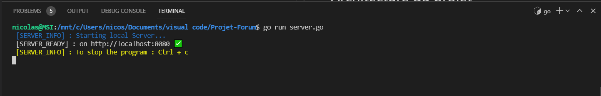
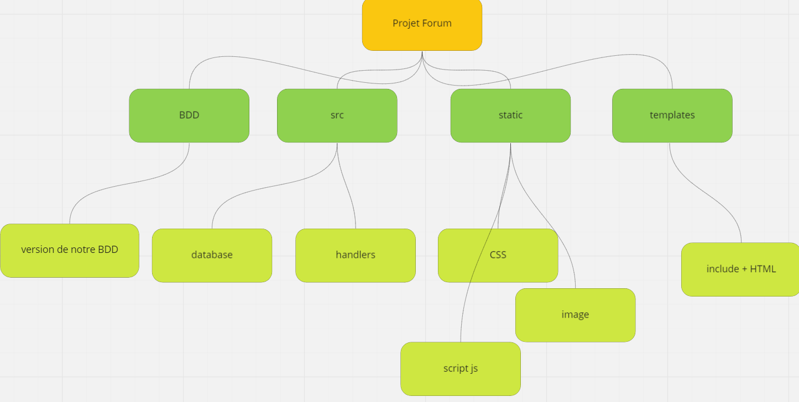

# Projet-Forum

Le projet consistait a créer un forum web fonctionnel avec différents condition, comme créer des posts, des commentaires, pouvoir ce connecter a l'aide d'identifiant , liker et filtrer par catégories ou posts.

# Installation du projet

Avant de lancer le forum plusieurs installation sont nécéssaires :

## _Installation de sqlite_ :  
> sudo apt update  
sudo apt install gcc

> go get github.com/mattn/go-sqlite3  
export CGO_ENABLED=1

## _Installation de uuid_ :
> go get github.com/google/uuid

## _Installation de Bcrypt_ :
> go get golang.org/x/crypto/bcrypt

# Déployer le forum

Pour lancer le forum, exécuter la commande suivante :
```bash 
go run server.go
```

Voila le résulta attendu :  




# Architecture du projet

Notre projet est constitué de plusieurs dossiers contenant eux même des sous-dossiers



* Le dossier **BDD** contenant notre base de donnée

* le dossier **src** contenant toutes les fonctions du back, en **go**

*  le dossier **static**  contenant toutes les fonctions pour le front, donc en **css, javascript**

* Et pour finir les **templates** en html,  **qui** perment d'afficher le forum 

# Outils 

Les différents outils exploité sont :

> Golang  
HTML  
CSS  
SQLITE  
JAVASCRIPT


# Equipe

Chef de projet :

```bash
Mathéo léger
```

Suivi de trois membres :

```bash
Louis Brochard  
Kévin GUYODO
Nicolas Segura
```

### Attention : Nicolas a commit avec son compte github mais aussi en anonyme a cause d'un bug github
