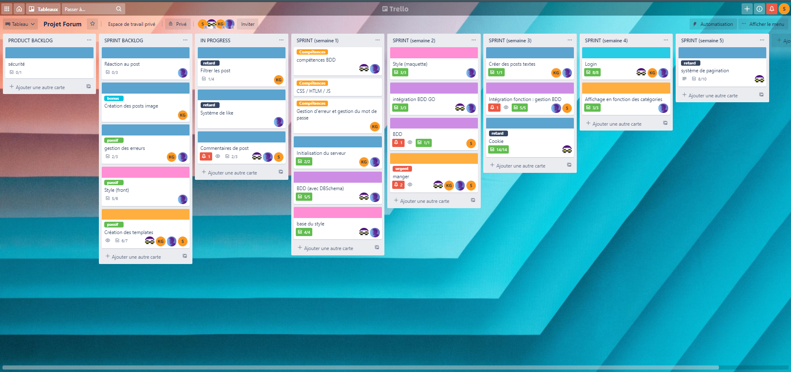
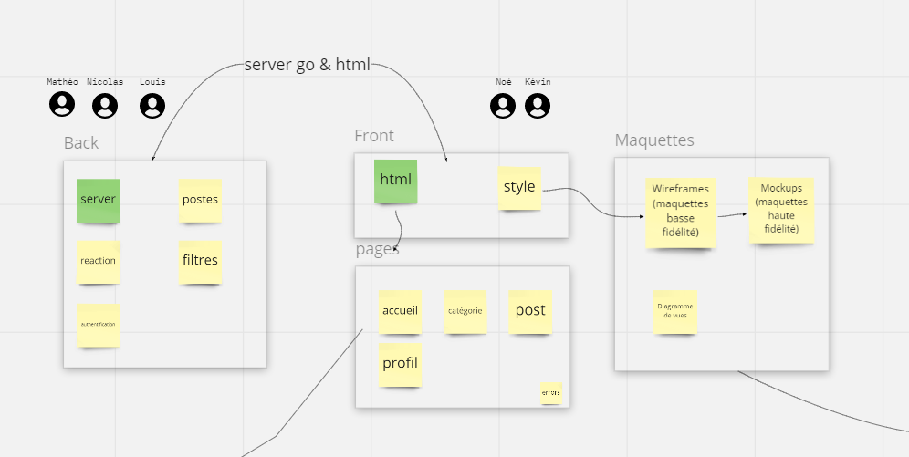
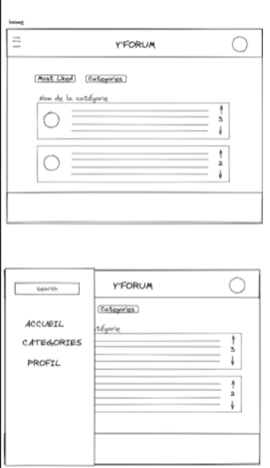
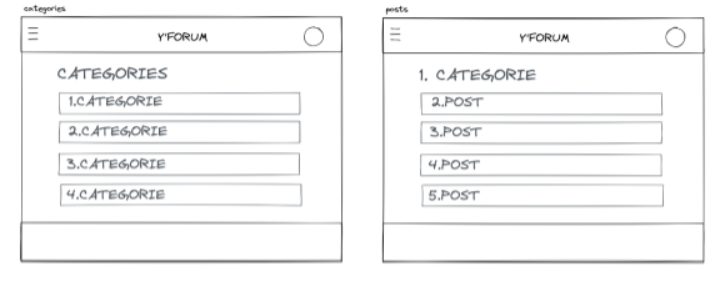
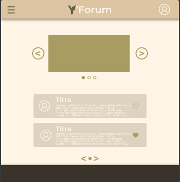
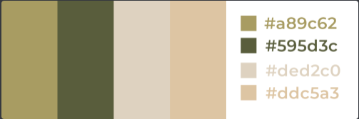
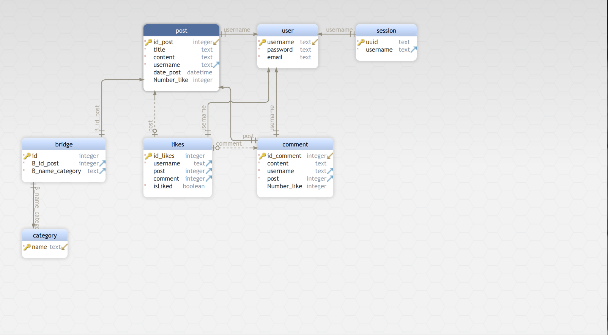

# _Documentation_

> ## Plannings

Pour effectué le suivi du projet forum, on a décidé d'utiliser l'application ``trello``.
Avec cela, nous avons utilisé le système de ``BACKLOG``. Ce système consiste a énumérer les tâches a faire chaque semaine.

``PRODUCT BACKLOG`` :
> Ce sont les différentes fonctionnalités a effectuer durant le projet

``SPRINT BACKLOG`` :
> Ce sont les fonctionnalités on cours de création pour le sprint d'une certain semaine

``IN PROGRESS`` :
> Ce sont les choses en cours 

``SPRINT(par semaine)`` : 
> A chaque fin de semaine, on met dans les sprints les fonctionnalités terminer

## Répartition des tâches

### ordre de priorité 

Au vu du projet, on a établie une liste de fonctionnalités primordial :

- Créer des posts

- Chaque post aura une ou plusieurs catégories (parmi une liste pré-déterminée)

- Laisser d'autres utilisateurs y réagir en postant des commentaires.

- Ajouter des likes/dislikes

- Les posts et commentaires seront accessible par tout le monde, mais participer nécessitera de créer un compte utilisateur

- on pourra filtrer les posts par catégorie pour ne voir que les posts qu'on a soi-même likés pour ne voir que les posts qu'on a soi-même postés 

### Répartition des tâches

On a du se repartir les tâches a quatre : Louis, Mathéo, Kévin et Nicolas

1.  Mathéo a effectué la création des posts ainsi que la fonctionnalité des likes/dislikes 

2. Kévin a fait les filtres et le login(hash ..)

3. Nicolas a fait les commentaires ainsi que la base de donnée (BDD)

4. Louis a effectué le systeme d'authentification(cookies...)  

> ## Maquettes

Pour créer les différentes maquettes du sites, nous avons utilisé ``miro`` et ``excalidraw`` 

Par rapport aux différentes maquettes réalisé, on a commencé par la création du logo (image ci-dessus).  
Nous sommes donc partis sur le theme de la nature   

  

Par la suite, on a fait la maquette de l'acceuil avec les différents boutons comme pour les catégories ou la navbar. Ceci n'est qu'une ébauche de notre site même si cette ébauche n'a pas trop bouger

La photo suivant est la maquette de la page des categories qui n'a pas bougé depuis le début du projet

Voici la maquette final de notre page acceuil avec les couleurs et les differents bouttons 

Voici le panel de couleurs utilisé

> ## BDD

Pour faire le shéma de notre BDD, on a utilisé l'application ``DBShema`` avec le langage ``sqlite``

Au début, avec le groupe, on était parti sur un système avec cinq tables :
table ``user, category, post, comment et like``

Puis on l'a amélioré en fonction de ce qu'on avait besoin par rapport au code

Par exemple :  
table ``session`` pour les ``cookie`` et les authentification

> table ``user`` :  
On a utilisé un **id** nommé ``"username"`` en **autoincremente** puis un deux colonnes texte pour ``"l'email"`` et le ``"password"``

> table ``category`` :  
Notre table ``category`` posséde juste un id ``name`` pour pouvoir nommé nos catégories

> table ``post`` :  
Un **id** appelé ``id_post`` toujours en **autoincrement** ainsi qu'un ``title, content et username``.Il a un colonne ``date_post`` de type date et un ``Number_like`` pour savoir le nombre de like sur un post. Le ``username`` de post est relié a l'**id** de la table ``user`` par **foreign key** et en **cascade** , ce qui permet de lier les posts aux users connectés.

> table ``comment`` :  
Ici, on a un ``id_comment`` et quatre colonnes : ``content, username, post, Number_like``. Il possède une **foreign key** de la conne ``post`` vers l'**id** de table ``post``, cela sert a lier les commentaires au différents posts sur le forum

> table ``likes`` :  
Cette table contient un ``id_likes``, trois colonnes : ``username, post, comment`` et pour finir un **booléan** nommé ``isLiked``  
Le booléan sert a savoir si on a cliqué sur ``like(true) ou dislike(false)``.  
Si on n'a pas intéragie avec le post/commentaires, il n'y pas de liaison avec ``username``  
Au niveau, des **foreign key**, on a ``post`` relié a ``id_post``, ``comment`` associé a ``id_comment`` et ``username`` affecté a ``username`` de table ``user``

> table ``session`` :  
Elle est composé d'un ``uuid``(**primary key**) et d'un ``username``.  
L'``uuid`` est un numéro session aléatoire et très long, ce qui rend impossible de l'avoir en double.  
Ici, il est lié a un utilisateur de la BDD, par la **foreign key** ``username``

> table ``bridge`` :  
Le ``bridge`` est une parti importante car il permet de faire la liaison entre les posts et les categories.  
Il a un **id** en **autoincrement** et deux autres colonnes en integer : ``B_id_post et B_id_category``  
C'est deux integer récupère les **id** des tables ``post`` et ``category`` pour pouvoir les relier dans un même tableau.
Les deux **foreign key** de cette table sont ``B_id_post`` vers l'**id** de la table post et ``B_id_category`` vers l'**id** de latable ``category``. Explication de leur fonctionnement juste au-dessus

**PS :** Partez du principe que toute les foreign key sont en cascade.Cascade signifie que si un enregistrement de la table parent est supprimé, les enregistrements correspondants de la table enfant seront automatiquement supprimés. 
Par exemple, si on supprime un user cela supprimera tout ses posts et commentaires 

Partez du principe que tout les id sont en autoincrement

> ## Spécifications techniques

Pour ce projet les technologies sont :

* html 
* go 
* js 
* css 
* sqlite 

On a donc adopté le langage ``go`` pour le back et pour le front, les langages utilisés sont ``html, css et javascript``

Mais, nous avons aussi exploité la technologie de **DBshéma** avec le langage ``sqlite``

Architecture du projet

## Spécifications fonctionnelles

* login
* post
* comment
* like
* filtre

> ## Architecture du projet readme?

voir idée de départ et ou on est arrivé